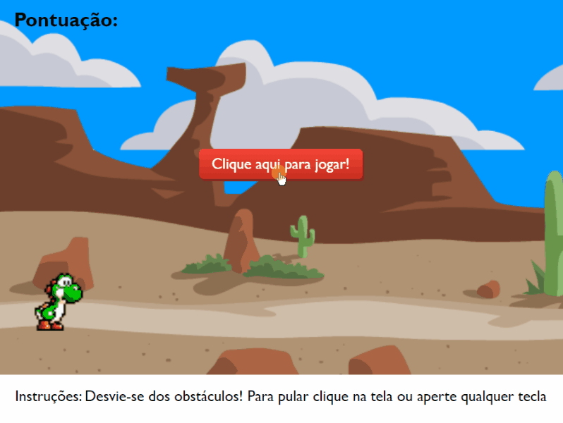

# Jogo do Dinossauro (estilo Infinite Runner)

Projeto utilizando Typescript e Angular 11.

* Animações configuradas no CSS e aplicadas por meio de classes.
* Movimento dos personagens utilizando a biblioteca rxjs.

Obs.: Foi retirado o botão jogar novamente, pois a reinicialização do jogo estava causando problemas com o movimento dos obstáculos.

&nbsp;

O desenvolvimento do projeto base foi feito a partir da atividade "Recriando o famoso jogo do dinossauro sem internet", de [Celso Henrique](https://github.com/celso-henrique/dio-dino-game), da Digital Innovation One.

&nbsp;

## Demonstração: [Link](http://jogo-infinite-runner.s3-website-sa-east-1.amazonaws.com)

&nbsp;

&nbsp;

## Créditos das imagens:
Sprites: SUPER MARIO WORLD 2: YOSHI'S ISLAND da Nintendo©

Background: [Dylan Squires](https://opengameart.org/content/several-scrolling-backgrounds-and-layerable-runners)

&nbsp;

&nbsp;

This project was generated with [Angular CLI](https://github.com/angular/angular-cli) version 11.0.2.

## Development server

Run `ng serve` for a dev server. Navigate to `http://localhost:4200/`. The app will automatically reload if you change any of the source files.

## Code scaffolding

Run `ng generate component component-name` to generate a new component. You can also use `ng generate directive|pipe|service|class|guard|interface|enum|module`.

## Build

Run `ng build` to build the project. The build artifacts will be stored in the `dist/` directory. Use the `--prod` flag for a production build.

## Running unit tests

Run `ng test` to execute the unit tests via [Karma](https://karma-runner.github.io).

## Running end-to-end tests

Run `ng e2e` to execute the end-to-end tests via [Protractor](http://www.protractortest.org/).

## Further help

To get more help on the Angular CLI use `ng help` or go check out the [Angular CLI Overview and Command Reference](https://angular.io/cli) page.
